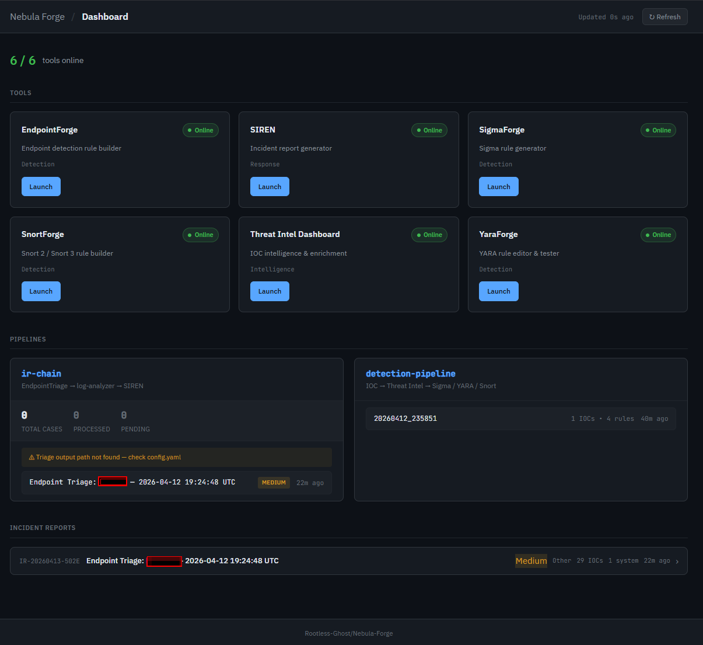
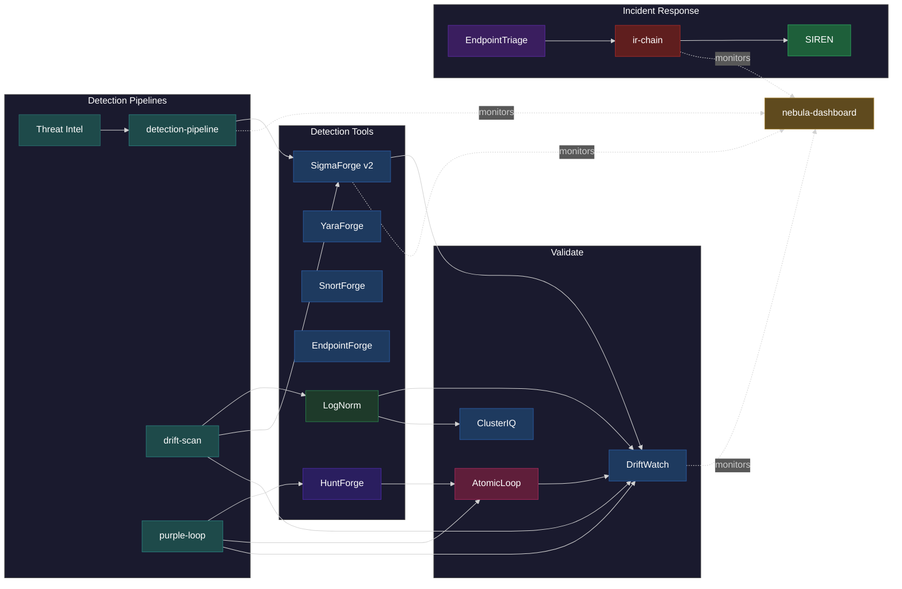

# Nebula Forge

> Open-source detection engineering and incident response tooling for SOC analysts and purple teams.

Built by a Navy veteran transitioning into cybersecurity — every tool in this org solves a real problem a SOC analyst faces daily. Not tutorial projects. Working tooling.

---

## What is Nebula Forge?

Nebula Forge is a detection engineering and IR platform covering the full SOC workflow. Each tool occupies a defined lane — from writing detection rules to collecting forensic evidence to generating incident reports. The flagship capability is the closed-loop validation pipeline between **SigmaForge** and **EndpointForge**: rules authored in SigmaForge deploy as native Wazuh XML and get validated against live endpoint telemetry from EndpointForge — closing the gap between writing a detection and knowing it actually works.

---

## Dashboard

> 6/6 tools online — live status, pipeline activity, and incident report viewer.

## The pipeline

---

## Tools

### Detection Suite v1

| Tool | Purpose | Phase | Stack |
|------|---------|-------|-------|
| [SigmaForge v2](./SigmaForge) | Custom Sigma conversion engine — 6 query backends (Splunk SPL, Elastic KQL, EQL, Sentinel KQL, Wazuh XML, QRadar AQL) plus Detection-as-Code JSON; no pySigma dependency | Detect | Flask, Python, CLI |
| [YaraForge](./YaraForge) | YARA rule builder with SQLite storage, live file scanning via yara-python, MITRE ATT&CK tagging, and bulk import/export | Detect | Flask, Python, SQLite |
| [SnortForge](./SnortForge) | Snort 2 and Snort 3 rule generator with multi-content chaining, PCRE support, and a 0–100 performance scorer with letter grade and actionable tips | Detect | Flask, Python, CLI |
| [EndpointForge](./EndpointForge) | Cross-platform HIDS with five scan modules — processes, network connections, filesystem integrity, registry (Windows), and persistence — MITRE ATT&CK mapped, with Wazuh log export | Detect | Flask, Python, CLI |
| [EndpointTriage](./EndpointTriage) | PowerShell forensic collector — 13 artifact categories (processes with hashes, network, scheduled tasks, registry persistence, event logs, DNS cache, named pipes, ARP, and more), outputs CSV/TXT files and a consolidated HTML report | Investigate | PowerShell |
| [SIREN](./SIREN) | NIST 800-61 IR report builder with timeline events, IOC and affected-system tracking, composite severity scoring (0–10), and Markdown/JSON export | Report | Flask, Python |
| [ir-chain](./ir-chain) | Automated IR pipeline — connects EndpointTriage, log-analyzer, and SIREN into a single zero-touch workflow; watches for new triage output, runs log analysis, and POSTs a structured incident payload to SIREN; `--purge-processed` flag deletes processed case folders older than a configurable retention window (default 30 days) | Integrate | Python, CLI |
| [detection-pipeline](./detection-pipeline) | IOC-to-rule automation — enriches indicators via Threat Intel Dashboard, filters by risk score, and fans out to SigmaForge, YaraForge, and SnortForge simultaneously to generate Sigma, YARA, and Snort rules in a single command | Detect | Python, CLI |
| [nebula-dashboard](./nebula-dashboard) | Central hub — live online/offline status for every Nebula Forge tool, one-click launch buttons, pipeline activity panels for ir-chain and detection-pipeline, SIREN incident report viewer (click any report to see full timeline, IOCs, affected systems, and recommendations), and a live countdown timer showing seconds until the next auto-refresh | Operate | Flask, Python |
| [Log Analyzer](./log-analyzer) | CLI tool for parsing Windows Security Event Log (CSV) and Linux auth.log; detects brute force (4625), off-hours logins (4624), privilege escalation (4728/4732/4756), and account lockouts (4740) | Detect | Python |
| [Phishing Analyzer](./phishing-analyzer) | CLI tool for analyzing .eml files; checks SPF/DKIM/DMARC, From/Reply-To mismatch, suspicious URLs (shorteners, TLDs, IP-based), dangerous attachments, and urgency keywords; scores suspicion 0–100 | Detect | Python |
| [Threat Intel Dashboard](./threat-intel-dashboard) | IOC reputation lookup for IPs, domains, file hashes, and URLs; queries VirusTotal and AbuseIPDB with auto-type detection; demo mode when no API keys are configured | Detect | Flask, Python |
| [Security Awareness Training](./security-awareness-training-main) | Multi-user web app with training modules, quizzes (70% pass threshold), phishing simulation scenarios with red-flag walkthroughs, and an admin dashboard for tracking user progress | Training | Flask, Python |

### Detection Suite v2

| Tool | Purpose | Phase | Stack |
|------|---------|-------|-------|
| [LogNorm](../LogNorm) | Log source normalizer — maps Sysmon, Windows Event Log, Wazuh, syslog, and CEF events to a shared ECS-lite schema; used as the data contract between v2 tools | Normalize | Flask, Python, SQLite |
| [HuntForge](../HuntForge) | MITRE ATT&CK threat hunt playbook generator — T-code to hypothesis, KQL/SPL queries, expected artifacts, and confidence score | Hunt | Flask, Python, SQLite |
| [DriftWatch](../DriftWatch) | Sigma rule drift analyzer — classifies rules as never-fired, overfiring, or healthy against real event data; generates gap analysis and tuning suggestions | Detect | Flask, Python, SQLite |
| [ClusterIQ](../ClusterIQ) | Contextual alert clustering engine — groups signals by similarity with context scoring across user, asset, time, and TI tags; outputs suppressed / review / escalate verdicts | Detect | Flask, Python, SQLite |
| [AtomicLoop](../AtomicLoop) | Atomic Red Team test runner — 20 embedded MITRE ATT&CK techniques, executes on Windows, captures ECS-lite events, validates Sigma rules fired; safety-gated with dry-run and confirm controls | Purple Team | Flask, Python, SQLite |

### Pipelines

| Pipeline | Purpose | Phase | Stack |
|----------|---------|-------|-------|
| [ir-chain](./ir-chain) | EndpointTriage → log-analyzer → SIREN — zero-touch IR workflow | Integrate | Python, CLI |
| [detection-pipeline](./detection-pipeline) | IOC → Threat Intel → Sigma / YARA / Snort — one command, three rule types | Detect | Python, CLI |
| [drift-scan](./pipelines/drift-scan) | Normalize raw logs via LogNorm → fetch Sigma rules from SigmaForge → DriftWatch coverage analysis; surfaces detection gaps against real log data | Detect | Python, CLI |
| [purple-loop](./pipelines/purple-loop) | HuntForge → AtomicLoop → DriftWatch — generate hunt playbook, execute atomic technique, validate detection fired; full purple team validation in one command | Purple Team | Python, CLI |

---

## Architecture

Every tool in Nebula Forge shares the same foundation:

- **Flask web UI** with a consistent dark theme
- **Python CLI engine** for scripting and automation
- **MITRE ATT&CK mapping** across detections and findings
- **Wazuh integration** where applicable — decoders, rules, and exporters

The SigmaForge ↔ EndpointForge cross-link uses a custom Sigma conversion engine — no pySigma dependency, which has no native Wazuh backend. Rules generated by SigmaForge are valid Wazuh XML out of the box.

### ECS-lite shared schema (v2 data contract)

The Detection Suite v2 tools communicate over a shared **ECS-lite** event schema — a lightweight subset of the Elastic Common Schema. LogNorm is the normalizer: it accepts raw Sysmon, Windows Event Log, Wazuh, syslog, and CEF events and emits ECS-lite JSON. Every downstream v2 tool (DriftWatch, ClusterIQ, AtomicLoop) consumes this format, so a log event normalized once is usable everywhere.

Key fields:

| Field | Type | Description |
|-------|------|-------------|
| `@timestamp` | ISO 8601 | Event time |
| `event.code` | string | Windows Event ID or equivalent |
| `event.action` | string | Human-readable action label |
| `event.category` | string | process / network / file / registry / authentication |
| `log.name` | string | Source log channel (e.g. `Microsoft-Windows-Sysmon/Operational`) |
| `host.name` | string | Originating hostname |
| `process.name` | string | Process image name (where applicable) |
| `process.command_line` | string | Full command line (where applicable) |

This schema is the handoff point between AtomicLoop (event capture), LogNorm (normalization), DriftWatch (Sigma validation), and ClusterIQ (alert clustering) — and is the reason the purple-loop and drift-scan pipelines require no shared database.

---

## Home lab

All tooling is validated against a live environment:

- **Wazuh server** — 192.168.46.100, v4.14.4
- **Agents** — Win11x01 (windows), SOC101-Ubuntu (linux), Kali-Purple (offensive), Nebula-C (offensive)
- **Sysmon** — SwiftOnSecurity config deployed on Win11x01

---

## Built by

[Rootless-Ghost](https://github.com/Rootless-Ghost) — Navy Corpsman, SOC analyst in training, purple team practitioner. Targeting SOC analyst and detection engineering roles in the Tampa Bay market.

PSAA → PSAP → Sec+ → CCDL1 → PAPA → PJPT + PNPT

---

## License

This project is licensed under the MIT License — see the [LICENSE](LICENSE) file for details.

*Nebula Forge — detection engineering tooling that works in the real world.*
